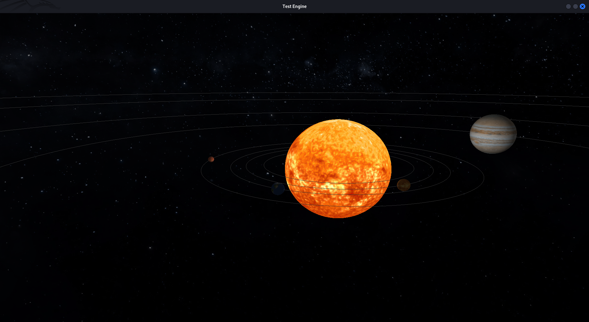

# Solar System Simulator

 <!-- Replace with actual screenshot path -->

A 3D solar system simulation built with OpenGL (C)

## Features

- 🪐 **3D Planetary System**
  - Sun with procedural surface texture
  - Planets with relative sizes and orbital periods
  - Configurable orbital rotation speeds
- 🌌 **360° Galaxy Background**
  - Equirectangular texture mapping (HDR/JPG supported)

## Prerequisites

- OpenGL 3.3+ compatible GPU
- C compiler (GCC/Clang)
- GLFW
- GLAD (included)
- STB Libraries (included)

## Installation

On Linux (only linux support for now)
```bash
# Clone repository
git clone https://github.com/La-cruz-kun/opengl-solar-system.git
cd opengl-solar-system

# compile
clang main.c include/stb.c include/shader_s.c -o main -Llib -lglad -lglfw -lm -lcglm

# then run
./main
